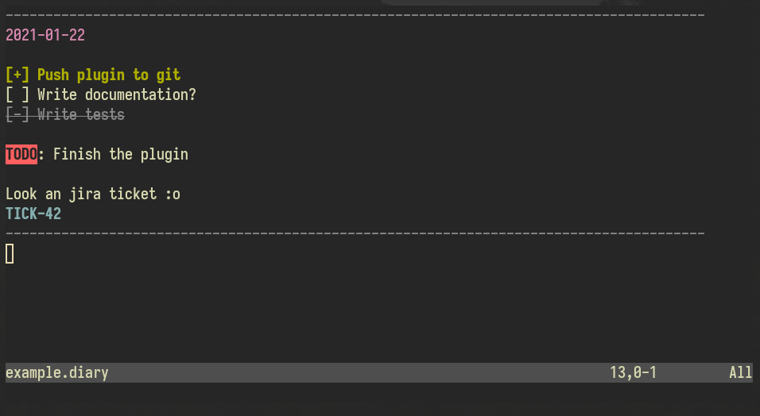

# What

An incomplete syntax plugin for diary entries.

## Show me?

# But why?

+ I wanted to learn some vimscript + how vim plugins are structured.
+ Markdown was not enough.
+ Markdown was too much.
+ I wanted to log my work using Jira ticket ID's and to be able to view the ticket details later.

# Features 

+ Fancy diary entries
+ Will support opening jira tickets in your browser of choice soon™.

# Customization?

Not right now, maybe later ok? (unless you fork it and modify to your liking)
